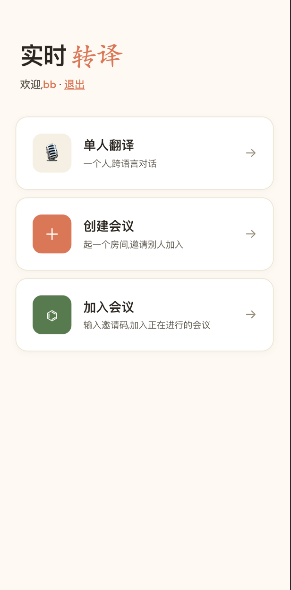
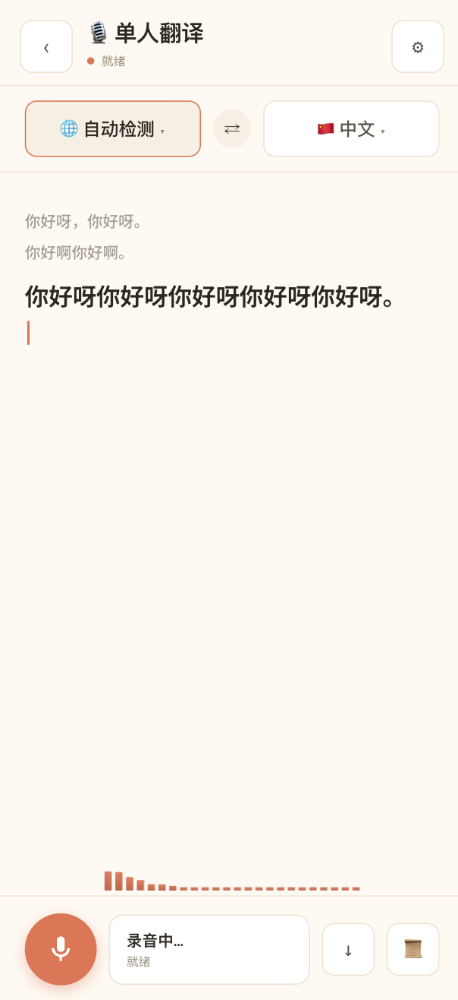
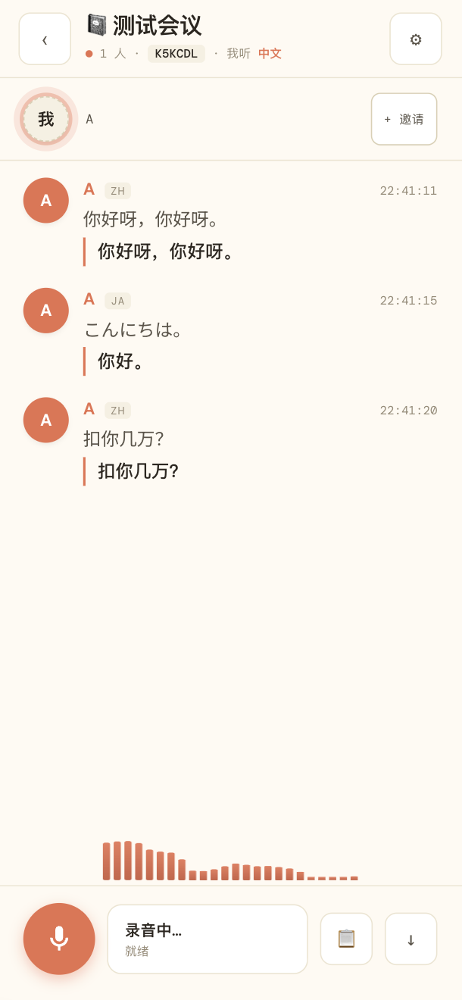

<div align="center">

# 🎙 实时转译 · Realtime Translate

**实时多语种语音翻译 — Apple Live Captions 风字幕、真实音波、多人会议房、移动端优先**

[](https://translate.viberules.app/)
[](https://www.python.org/)
[](https://fastapi.tiangolo.com/)
[](https://sqlite.org/)
[](#license)
[](#contributing)

[在线体验](https://translate.viberules.app/) · [快速开始](#-快速开始) · [架构](#-架构) · [API](#-api) · [Roadmap](#-roadmap)

</div>

---

## 📸 截图

<div align="center">
<table>
<tr>
<td width="33%" align="center">
<br>
<b>🏠 主页</b><br>
<sub>单人 / 会议 双入口,暖色调 Workspace 风</sub>
</td>
<td width="33%" align="center">
<br>
<b>🎙 单人字幕</b><br>
<sub>Apple Live Captions 风 + 真实 FFT 音波</sub>
</td>
<td width="33%" align="center">
<br>
<b>👥 多人会议</b><br>
<sub>邀请码加入,各成员听本语</sub>
</td>
</tr>
</table>
</div>

---

## ✨ 核心功能

| | |
|---|---|
| 🎯 **真流式字幕** | OpenAI Realtime delta 字符级浮入,DashScope 整句到达 stagger 浮出 — 250ms expo-out + blur 渐清晰 |
| 👥 **多人会议** | 6 位邀请码,各成员选自己听的语言,server 单次 ASR 多向广播,SQLite 持久化 |
| 🌐 **26+ 语种** | Qwen3-ASR 支持 26 种识别,DeepSeek 翻译至任意语言,OpenAI 直译 13 种端到端 |
| 📊 **真实音波** | Web Audio AnalyserNode + FFT 24 段橙色频谱柱,实时跟随麦克风音量 |
| 🛡 **VAD 反幻觉** | Silero VAD ONNX (ricky0123/vad-web) 浏览器端运行,静音帧不上传,抑制 ASR 对呼吸/键盘声的幻觉 |
| 🔐 **登录 + 试用** | 邮箱注册 (scrypt 哈希 + cookie session),默认每用户 3 次免费会话 |
| 📊 **数据后台** | `/admin/stats` 内置仪表盘 — 总用户/活跃/录音/翻译条目 + 7 天折线图 + Top 用户表 |
| 💾 **历史 + 导出** | SQLite WAL 持久化,每条录音可导出 Markdown,房间消息可全文导出 |
| 📱 **PWA 风移动端** | 全屏 100dvh,safe-area 适配,字幕字号自动调整,iOS 防 zoom |
| 🎬 **生产级动效** | Splash 启动屏、view 切换、按钮 spring、modal slide-up、toast bounce — 统一 motion tokens,`prefers-reduced-motion` 兜底 |

---

## 🚀 快速开始

### Docker (自构建)
```bash
git clone https://github.com/Timelk/realtime-translate.git
cd realtime-translate
docker build -t realtime-translate .
docker run -d \
  -p 8800:8800 \
  -e DASHSCOPE_API_KEY=sk-xxx \
  -e DEEPSEEK_API_KEY=sk-xxx \
  -e OPENAI_API_KEY=sk-xxx \
  -v $(pwd)/data:/app/data \
  --name translate \
  realtime-translate
```

### 本地开发
```bash
git clone https://github.com/Timelk/realtime-translate.git
cd realtime-translate

cp .env.example .env  # 填入你的 API keys

uv sync              # 安装依赖 (Python 3.11+)
./serve.sh start     # 后台启动 with --reload, 日志在 .server.log

open http://localhost:8800
```

### serve.sh 命令
```bash
./serve.sh start     # 启动 (后台 + reload)
./serve.sh stop      # 停止
./serve.sh restart   # 重启
./serve.sh status    # 状态 + PID
./serve.sh logs      # 实时日志
./serve.sh fg        # 前台运行(开发调试)
```

---

## 🔧 配置

环境变量(`.env` 文件):

| 变量 | 必填 | 默认 | 说明 |
|---|---|---|---|
| `DASHSCOPE_API_KEY` | ✓ | — | 阿里云 DashScope key,用于 Qwen3-ASR + Qwen3-TTS |
| `DEEPSEEK_API_KEY` | ✓ | — | DeepSeek-V4-Flash 翻译 |
| `OPENAI_API_KEY` |  | — | OpenAI gpt-realtime-translate(可选,默认 UI 已隐藏) |
| `VAPID_PUBLIC_KEY` |  | — | Web Push public key. If absent, push subscription UI is disabled |
| `VAPID_PRIVATE_KEY` |  | — | Web Push private key used to send DM notifications |
| `VAPID_CLAIM_EMAIL` |  | `admin@example.com` | Contact email included in VAPID claims |
| `DB_PATH` |  | `app.db` | SQLite 路径 |
| `TRIAL_LIMIT` |  | `3` | 每用户免费录音次数,`0` 不限 |
| `PORT` |  | `8800` | HTTP/WS 端口 |

---

## 🏗 架构

<div align="center">

</div>

- **Browser**:Vanilla JS SPA + Web Audio FFT 音波 + Silero VAD ONNX + Apple Live Captions UI
- **WebSocket**:PCM16 24kHz 上行 + JSON 控制命令 + transcript / translation / audio 下行
- **FastAPI Server**:RoomManager(内存 + db fallback)、RecordingSession 延迟创建、试用限制、反幻觉过滤
- **引擎**:`pick_backend()` 智能路由
  - `engine=openai` + `translate=true` + target ∈ OpenAI 13 种 → **OpenAI Realtime** 端到端
  - 其他 → **Qwen3-ASR + DeepSeek + Qwen3-TTS** 三跳链路
- **存储**:SQLite WAL 单文件,5 张表(`users` / `sessions` / `recordings` / `rooms` / `room_messages`),per-call connection 无锁并发

---

## 🌍 支持语种

**Qwen3-ASR 识别**(26 种):自动检测 / 中文 / 英语 / 日语 / 韩语 / 西班牙语 / 法语 / 德语 / 俄语 / 葡萄牙语 / 意大利语 / 阿拉伯语 / 印地语 / 印尼语 / 泰语 / 土耳其语 / 越南语 / 荷兰语 / 瑞典语 / 丹麦语 / 芬兰语 / 波兰语 / 捷克语 / 菲律宾语 / 马来语 / 挪威语

**DeepSeek 翻译目标**:任意语种(LLM 自由翻译)

**OpenAI gpt-realtime-translate**(13 种端到端):中 / 英 / 日 / 韩 / 西 / 法 / 德 / 葡 / 意 / 俄 / 阿 / 印地 / 印尼

---

## 📡 API

### REST

| 方法 | 路径 | 说明 |
|---|---|---|
| `POST` | `/auth/register` | 邮箱 + 密码 ≥ 6 位 + 昵称,自动 set-cookie |
| `POST` | `/auth/login` | 登录,set-cookie |
| `POST` | `/auth/logout` | 撤销 session |
| `GET` | `/auth/me` | 当前用户 + trial 状态 |
| `GET` | `/recordings` | 本人录音列表(JSON) |
| `GET` | `/recordings/{id}.md` | 单条录音导出 Markdown |
| `DELETE` | `/recordings/{id}` | 删除录音 |
| `GET` | `/rooms` | 本人参与过的房间 |
| `GET` | `/export?code=XXX` | 房间消息全文导出 Markdown |
| `GET` | `/admin/stats` | 数据后台 HTML(登录可见) |
| `GET` | `/admin/api/stats` | 统计 JSON: overview + daily + top_users |

### WebSocket `/ws`

**client → server**

```json
{"command": "start", "lang": "auto", "target": "zh",
 "translate": true, "tts": false, "engine": "dashscope"}

{"command": "audio", "data": "<base64 PCM16 24kHz>"}

{"command": "stop"}

{"command": "update_config", "lang": "ja", "target": "en"}

{"command": "create_room", "room_name": "周会", "name": "我", "target": "zh"}
{"command": "join_room",   "code": "K5KCDL",  "name": "我", "target": "en"}
{"command": "leave_room"}
{"command": "speak_start"} / {"command": "speak_stop"}
```

**server → client**

```json
{"type": "welcome", "recording_id": "20260512-..."}
{"type": "ready",   "engine": "dashscope"}
{"type": "transcript",  "text": "你好", "lang": "zh", "final": true}
{"type": "translation", "text": "Hello", "final": true}
{"type": "audio", "data": "<b64 pcm>", "sample_rate": 24000}    // TTS
{"type": "error", "code": "trial_limit", "used": 3, "limit": 3}

// Room
{"type": "room_joined", "code": "K5KCDL", "members": [...]}
{"type": "member_joined" | "member_left", ...}
{"type": "room_message",      "turn_id": "...", "speaker_id": "...",
 "src_lang": "ja", "text": "こんにちは", "ts": "22:41:15"}
{"type": "room_translation",  "turn_id": "...", "tgt": "zh", "text": "你好"}
{"type": "speaking", "member_id": "...", "speaking": true}
```

---

## 🛠 用户管理 (admin_cli)

适用于运维 / 给特定用户重置密码:

```bash
uv run admin_cli.py create  <email> <昵称>   # 手动创建用户
uv run admin_cli.py list                      # 列所有用户
uv run admin_cli.py passwd  <email>           # 重置密码 + 撤销所有 session
uv run admin_cli.py delete  <email>           # 删除用户 (含 recordings + rooms)
```

---

## 📊 数据后台

登录后访问 `/admin/stats`,看到:

- **5 张 stat 卡片** — 总用户 / 7d 活跃 / 总录音 / 翻译条目 / 房间
- **7 天 daily 折线图** — 纯 SVG,无依赖
- **Top 10 用户表** — 按录音数排序 + 最近活跃时间
- **30s 自动刷新**

可基于 `db.stats_overview()` / `daily_recordings()` / `top_users_by_recordings()` 自行扩展自定义指标。

---

## 🎬 UI 动效系统

统一 motion tokens(CSS variables),全产品共享一套节奏:

```css
--d-fast: 160ms;   --d-base: 240ms;   --d-slow: 360ms;
--e-out:    cubic-bezier(0.22, 1, 0.36, 1);     /* 入场 */
--e-in:     cubic-bezier(0.5, 0, 1, 0.4);       /* 退场 */
--e-spring: cubic-bezier(0.2, 0.9, 0.25, 1.15); /* 弹簧 */
```

12 个动效模块:Splash 启动屏(首访 1.2s 品牌时刻 + cookie 记忆)/ View 切换 / 元素 stagger 入场 / 字幕字符浮入 + blur clean / 按钮 press scale / Engine bar sliding underline / Mic burst 启动反馈 / Modal spring slide-up / Toast bounce / Skeleton shimmer / 列表 stagger / 真实 FFT 音波。

全部尊重 `prefers-reduced-motion: reduce` 系统级偏好(WCAG)。

---

## 🗺 Roadmap

- [ ] **流式翻译** — DeepSeek `stream:true` SSE,译文字符级浮入
- [x] **PWA installable + DM push** — `manifest.webmanifest` + service worker + Web Push opt-in
- [ ] **房间录音回放** — 把房间 PCM 存 S3,事后回放
- [ ] **Admin 权限粒度** — `users.is_admin` 列,non-admin 只看自己 stats
- [ ] **Webhook 通知** — 录音完成 / 试用超额时推 webhook
- [ ] **多用户付费等级** — Stripe + 等级表 + 配额
- [ ] **i18n UI** — 当前只中文,加 EN/JA 切换
- [ ] **桌面应用 (Tauri)** — 系统级 hotkey + tray

---

## 🤝 Contributing

PR / Issue 欢迎。前端是 vanilla JS 单文件 (`static/index.html` ~3500 行),无构建工具;后端 FastAPI 单文件 (`server.py`)。

代码风格:
- Python:Ruff
- 提交信息:简体中文 conventional commits(`feat: ...` / `fix: ...` / `docs: ...`)

---

## 🛡 隐私

- 你的 API keys 只走你的服务器,不上传任何第三方
- 用户密码用 scrypt 哈希(n=2^14, r=8, p=1)
- 录音音频不持久化,只保存 transcript + translation 文本
- VAD 在浏览器端 ONNX 推理,音频不离开本地直到 VAD 判定为人声

---

## 📄 License

[MIT](LICENSE) — 自由商用 / 修改 / 分发,只需保留 copyright。

---

## 🙏 致谢

- [Qwen3-ASR](https://github.com/QwenLM) — 阿里通义千问语音识别
- [DeepSeek-V4](https://www.deepseek.com/) — 翻译质量惊艳
- [OpenAI Realtime](https://platform.openai.com/docs/guides/realtime) — 端到端流式翻译
- [@ricky0123/vad-web](https://github.com/ricky0123/vad) — Silero VAD ONNX 浏览器封装
- [DashScope WS](https://help.aliyun.com/zh/dashscope/) — 阿里 ASR/TTS 入口

---

<div align="center">

**[🎙 立即试用 translate.viberules.app](https://translate.viberules.app/)**

Made with care · 给会议、给学生、给跨国朋友、给独行旅人

</div>
